# Analisis de algoritmos de ordenamiento

## 1. Definición y procedimiento

Como parte de un ejercicio típico de algoritmia en la Universidad, hice un pequeño análisis comparativo de los algoritmos de ordenamiento más populares, buscando estudiar la complejidad de cada uno de ellos y como las diferentes formas de resolver un mismo problema pueden afectar los tiempos de ejecución. Quiero aclarar que este es solo un análisis academíco muy simple que quiero documentar, el cual tal vez sirva a futuro para otros estudiantes de ciencias de la computación.

Comence desarrollando un pequeño script en Java que permite generar numeros aleatorios de cinco digitos y almacenarlos en un archivo de texto, esto con el fin de poder analizar el mismo conjunto de datos entre los diferentes algoritmos; el script correspondiente lo puede hallar y ejecutar de la siguiente forma:

```
# Ruta del archivo
> algorithms/java/RandomNumbers.java

# Ejecutar script en Java
$ javac RandomNumbers.java && java RandomNumbers
```

Lo anterior generará el archivo de texto **numbers/numbers.txt** con *n* numeros aleatorios que se especifiquen dentro del script de Java; dentro de mis experimentos el archivo que generé fue de 1.000.000.000 millones de datos, el cual no adjunto en el repositorio debido a que termino pesando cerca de 5 GB.

En un paso siguiente procedí a implementar los algoritmos de ordenamiento:
* **[Burbuja (Bubble Sort)](https://es.wikipedia.org/wiki/Ordenamiento_de_burbuja):** Complejidad O(n^2)
* **[Conteo (Counting Sort)](https://es.wikipedia.org/wiki/Ordenamiento_por_cuentas):** Complejidad O(n+k)
* **[Montones (Heapsort)](https://es.wikipedia.org/wiki/Heapsort):** Complejidad O(n log n )
* **[Inserción (Insertion Sort)](https://es.wikipedia.org/wiki/Ordenamiento_por_inserci%C3%B3n):** Complejidad O(n^2)
* **[Mezclas (Merge Sort)](https://es.wikipedia.org/wiki/Ordenamiento_por_mezcla):** Complejidad O(n log n).
* **[Rápido (Quicksort)](https://es.wikipedia.org/wiki/Quicksort):** Complejidad O(n log n).
* **[Selección (Selection Sort)](https://es.wikipedia.org/wiki/Ordenamiento_por_selecci%C3%B3n):** Complejidad O(n^2).

Para esta tarea seleccione el lenguaje C y los scripts obtenidos los pueden encontrar en **algorithms/c/sortAlgorithms**

Por último, dado que para hacer un buen análisis se deben correr muchas pruebas, cree un par de scripts que me permitieran automatizarlas de forma tal que se pudieran correr de forma continua sin intervención, estos son:

```
# Archivo desde el cual se puede correr cualquiera de los algoritmos implementados y permite crear arreglos de forma dinámica con base a la cantidad de elementos a ordenar. Este script además genera dos archivos de salida en el folder "results" con logs sobre los tiempos de ejecución del algoritmo
> algorithms/c/benchmark.c

# Correr prueba
# arg1, arg2 => Son el tipo (nombre) del algoritmo y la cantidad de elementos a probar
$ gcc benchmark.c -o benchmark.out && ./benchmark.out arg1 arg2

---

# El script runtTest.c permite correr multiples pruebas para los diferentes algoritimos y diferentes cantidades de datos haciendo uso del script anterior
> algorithms/c/runTest.c

# Correr pruebas
$ gcc runTest.c -o runTest.out && ./runTest.out
```

En este punto ya tenemos todo listo para hacer las pruebas, solo necesitamos poner a correr nuestro archivo *runtTest.c* en alguna maquina, y dado que esto es un simple ejercicio académico no requiere de mucho rigor científico, pero procure crear un pequeño ambiente controlado en un par de servidores donde no estuvieran ejecutandose en paralelo otras tareas, dado que los tiempos de ejecución de cada prueba puede verse afectado al estar compartiendo recursos con otros procesos.

Dicho lo anterior cree dos **droplets** (término para llamar a servidores en la nube) en
[Digital Ocean](https://www.digitalocean.com/pricing/), los cuales corresponden a:


Como se puede observar en la imagen anterior, el segundo servidor posee el doble de capacidades de procesamiento, con lo cual se espera obtener un mejor rendimiento en las pruebas.

Finalmente procedo a configurar el servidor asegurandome de tener los compiladores tanto de Java y C; pueden encontrar el archivo de aprovisionamiento que corri en cada uno de los servidores en **ServerConfig/provision.sh**.

```
# Base installation
sudo apt-get update -y
sudo apt-get upgrade -y
sudo apt-get install -y build-essential gcc python-dev python-pip python-setuptools

# Git
sudo apt-get install -y git

# Install Java
sudo apt-get install default-jre -y
sudo apt-get install default-jdk -y
sudo apt-get install openjdk-7-jre -y
sudo apt-get install openjdk-7-jdk -y
```

## 2. Resultados

En cada maquina se corrieron las pruebas con el mismo archivo de numeros aleatorios a ordenar, en intervalos inicialmente de 10 en 10, luego 100 en 100, luego 1.000, luego 10.000 etc, hasta 1.000.000.000 de datos; estos resultados se pueden visualizar en el archivo **results/analysis.ods**.

En este punto hago un parentesis para documentar el truco que utilice para poder correr los el archivo de pruebas en background y de esa forma no depender de una sesion activa en la terminal para correr las mismas:

```
# Correr pruebas
$ gcc runTest.c -o runTest.out && ./runTest.out

# Detenemos el proceso usando Ctrl + z
# Una vez hecho esto ejecutamos lo siguiente
disown -h %1
bg 1

# Lo anterior básicamente hace que el último proceso que se habia ejecutado corra en background, algo muy similar a lo que hace el &, solo que en este caso si cierro la sesion en la terminal no se detendra el programa.

```

Al cabo de 3 o 4 días de haber lanzado el archivo **runTest.c**, revise que los procesos y apenas iban en 1.600.000 de datos, me parecio que era suficiente para sacar conclusiones así que decidí parar el experimento en ambos servidores, y ahora procedo a mostrar los resultados obtenidos comparando los tiempos de respuesta de cada algoritmo en cada maquina:

M1 = Maquina 1 (1 nucleo, 1GB de RAM)
M2 = Maquina 2 (2 nucleos, 2GB de RAM)

#### 2.1. Burbuja (Bubble Sort): O(n^2)
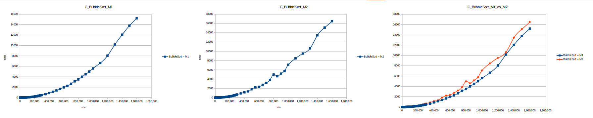

#### 2.2. Conteo (Counting Sort): O(n+k)
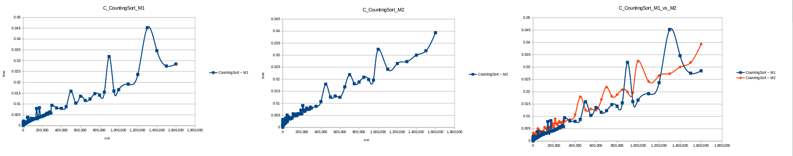

#### 2.3. Montones (Heapsort): O(n log n)
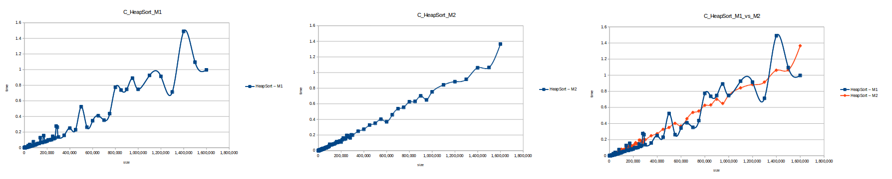

#### 2.4. Inserción (Insertion Sort): O(n^2)
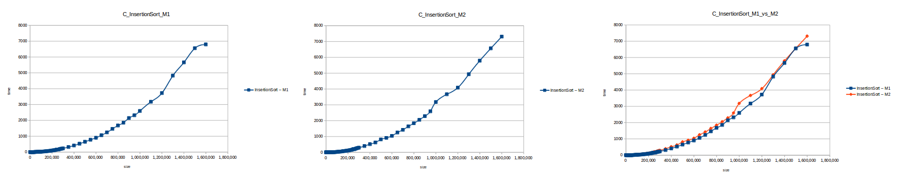

#### 2.5. Mezclas (Merge Sort): O(n log n)
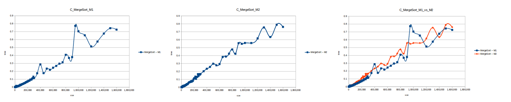

#### 2.6. Rápido (Quicksort): O(n log n)
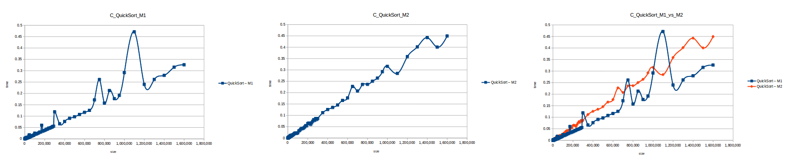

#### 2.7. Selección (Selection Sort): O(n^2)
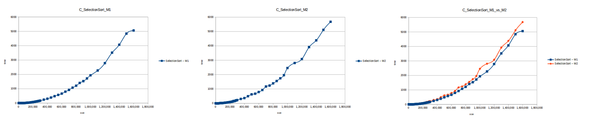

Como se puede observar en cada imagen se muestra la gráfica de cada algoritmo, primero en la maquina 1, luego en la maquina 2 y por último una tercera gráfica comparando ambas, donde la curva azul representa la máquina 1 y la linea naranja la maquina 2; como resultado de la simple observación, se puede concluir que la maquina 1 fue superior a la maquina 2, al menos menos por un pequeño margen en algunos casos. Pero porque es esto posible? acaso la maquina 2 no tenia el doble de recuersos que la maquina 1? dejaré esta incognita para un poco más adelante, primero determinemos cual de los algoritmos, fue el ganador, cosa que de antemano deberíamos ya suponer con solo conocer cada una de las complejidades algoritmicas:

#### 2.8. Gráfica comparativa de todos los algoritmos
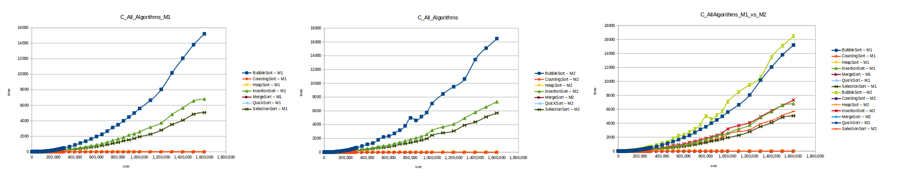

Como se puede observar en esta gráfica comparativa, no podemos conocer a ciencia cierta quien fue el ganador, dado que hay 4 algoritmos solapan entre si debido a la escala de la gráfica, y corresponden al **quickSort, mergeSort, heapSort y countingSort**, pero con total seguridad tenemos un claro perdedor, el cual fue el algoritmo burbuja con una complejidad algoritmica de O(n^2), seguido del **insertionSort** y el **selectionSort**, los cuales tienen igual una complejidad de O(n^2) pero sus implementaciones son un poco más eficientes dado que se hacen menos comparaciones, pero no dejan de ser unos algoritmos poco eficientes.

A continuación imprimiré los últimos 7 tiempos obtenidos para cada algoritmo y para cada maquina en segundos, tener en cuenta que la primera columna **size** representa la cantidad de datos a ordenar.

| Size  |  BubbleSort – M1 | CountingSort – M1  | HeapSort – M1  | InsertionSort – M1 | MergeSort – M1 | QuickSort – M1 | SelectionSort – M1
|---|---|---|---|---|---|---|---|
| 1,000,000 | 5584.254499 | 0.016609 | 0.747395 | 2592.498977 | 0.704281 | 0.291499 | 1935.487457 |
| 1,100,000 | 6637.222252 | 0.019187 | 0.925764 | 3171.445715 | 0.653455 | 0.471039 | 2269.966268 |
| 1,200,000 | 8045.953682 | 0.023652 | 0.913537 | 3722.638885 | 0.513099 | 0.239454 | 2783.279525 |
| 1,300,000 | 10169.383378 | 0.045208 | 0.713308 | 4824.250285 | 0.575149 | 0.261289 | 3514.914589 |
| 1,400,000 | 12053.658798 | 0.034613 | 1.489084 | 5658.739951 | 0.676112 | 0.279478 | 4066.729922 |
| 1,500,000 | 13798.854123 | 0.027525 | 1.094257 | 6555.365499 | 0.743651 | 0.315602 | 4839.340426 |
| 1,600,000 | 15205.680544 | 0.028478 | 0.996648 | 6794.512119 | 0.725347 | 0.32599 | 5056.213092 |

| Size  |  BubbleSort – M2 | CountingSort – M2  | HeapSort – M2  | InsertionSort – M2 | MergeSort – M2 | QuickSort – M2 | SelectionSort – M2
|---|---|---|---|---|---|---|---|
| 1,000,000 | 7069.317038 | 0.032415 | 0.752168 | 3178.694237 | 0.5582 | 0.315689 | 2454.531144 |
| 1,100,000 | 8458.150387 | 0.024157 | 0.842038 | 3666.359787 | 0.557481 | 0.284579 | 2804.449695 |
| 1,200,000 | 9495.898708 | 0.02653 | 0.882819 | 4084.581924 | 0.616636 | 0.358502 | 3081.74825 |
| 1,300,000 | 10626.023771 | 0.027309 | 0.913814 | 4933.201883 | 0.75389 | 0.401456 | 3912.714921 |
| 1,400,000 | 13439.250082 | 0.030009 | 1.061221 | 5790.797804 | 0.63318 | 0.442449 | 4066.729922 |
| 1,500,000 | 15102.736592 | 0.031826 | 1.064744 | 6565.630358 | 0.788551 | 0.400238 | 5114.565289 |
| 1,600,000 | 16483.694808 | 0.039298 | 1.365129 | 7311.347004 | 0.760618 | 0.449284 | 5676.768371 |

Dando un vistazo a estas tablas ya deberíamos conocer el ganador, pero ya que una imagen vale más que mil palabras vamos a ello y ahora graficaremos solo los algoritmos veloces, que son el **quickSort, mergeSort, heapSort y countingSort**, de los cuales casi ninguno supero 1 segundo ordenando 1,600,000 de datos
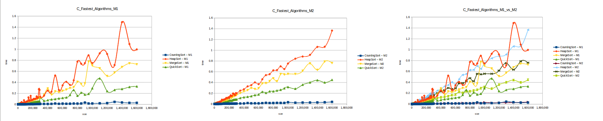

Como ya lo debíamos de suponer el claro ganador fue el algoritmo de **contéo (countingSort)** con una complejidad algoritmica de O(n+k), siendo **n** la cantidad de datos a ordenar y **k** el tamaño del vector auxiliar (máximo - mínimo). Pero no todo es color de rosas para el algoritmo de contéo, debido a que tiene una gran limitación, la cual es que solo funciona con numeros enteros, dado que requiere de un vector auxiliar donde almacenar la cuenta de cada valor; y por otro lado incluso cuando queremos ordenar solo numeros enteros si la diferencia entre el máximo y el mínimo de los datos a ordenar es muy grande, el vector auxiliar requerido implica un consumo excesivo de memoria, lo cual hace que la balanza se incline cada vez más en contra, pero como hemos probado, bajo condiciones específicas, el algoritmo de **contéo** es una de las mejores técnicas para ordenar datos, seguido del **quickSort** quien obtuvo el segundo lugar en este experimento, algoritmo con una complejidad de O(n log n), siendo uno de los más usados con el cual puedes ordenar también numeros reales; pero que igual que el algoritmo de **contéo** tiene sus falencias, dado que hay casos extremos en los cuales la complejidad se puede elevar a O(n^2) dependiendo de la distribución de los datos y una mala elección del pivote.

Las consideraciones anteriores son un claro ejemplo de los retos que enfrentamos día a día quienes trabajamos en ciencias de la computación, existe una gran cantidad de lenguajes de programación, herramientas y soluciones diversas a un mismo problema, pero cada una con un campo de acción enfocadas a condiciones específicas.

### 3. Maquina 1 vs Maquina 2

Antes de terminar con este breve análisis, habíamos dejado una incognita unos parrafos atrás, donde encontramos que la maquina 1 vencio a la maquina 2 en tiempos de respuesta, pero ¿como fue posible si poseía el doble de recursos? La respuesta la encontramos en la capacidad de procesamiento de cada maquina, en teoria en M2 tenemos a disposición dos nucleos de procesamiento para ejecutar instrucciones, ¿pero realmente ambos nucleos estan corriendo en paralelo para dar solución a mis procesos de ordenamiento? la respuesta en este caso es **NO**, nuestros algoritmos no estan programados de forma tal que puedan usar todos los nucleos de la maquina, para ello deberíamos usar hilos y poder dividir tareas de forma tal que nuestros procesos puedan hacer varias cosas al tiempo por medio del uso de hilos, pero a pesar de lo anterior, dentro los algoritmos que estamos analizando no todos se pueden paralelizar, dado que siguen una rigurosa secuencia de tareas.

Hasta este punto lo único que hemos aclarado es que en cuanto a capacidad de procesamiento, ambas maquinas se encuentran en las mismas condiciones (1 nucleo de procesamiento en uso), pero en este caso M2, deberia seguir teniendo la ventaja, dado que posee el doble de memoria RAM, o es que acaso ¿a más memoria peor rendimiento? ¡¿QUEE?!, tranquilo querido lector hay una mejor explicación, cada nucleo de procesamiento tiene asociada una frecuencia de reloj, la cual permite definir la velocidad a la cual se pueden ejecutar tareas por segundo y esta expresada en **Hertz**, es decir, mide la cantidad de ciclos de procesamiento en un segundo de tiempo (Cantidad de ciclos que suceden en un segundo).

Esta medida se presenta en las siguientes unidades:

* 1 Hertz (Hz)= un ciclo/segundo
* 1 Kilohertz (KHz)= 1024 Hz
* 1 MegaHertz (MHz)= 1024 KHz
* 1 GigaHertz(GHz)= 1024 MHz
* 1 TeraHertz (THz)= 1024 GHz

Por lo tanto si un procesador tiene una velocidad de 1 MHz, esto se traduce en que el procesador ejecuta 1 millon de ciclos en un segundo. Así que saquemonos de dudas y veamos cual es la frecuencia de procesamiento de cada una de nuestras maquinas:

```
# Acceso al servidor y ejecuto el comando lscpu, el cual me entrega información acerca de la arquitectura de los CPU presentes en el sistema.
$ lscpu
```

#### 3.1. Información del sistema para la M1
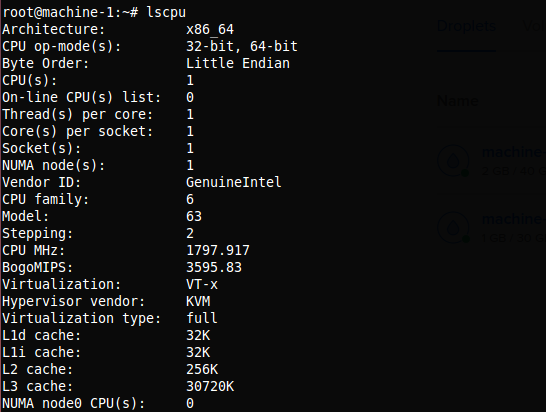

#### 3.2. Información del sistema para la M2
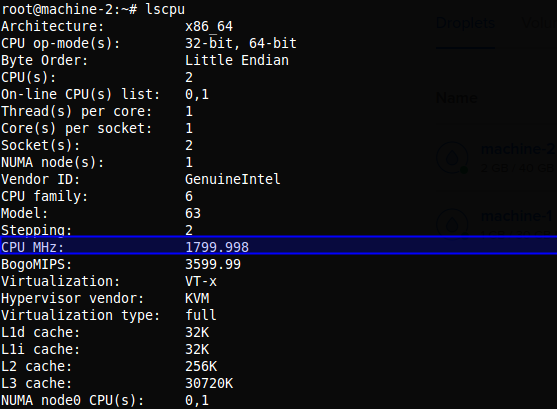

Rápidamente obtenemos la respuesta a nuestra pregunta; M1 tiene una frecuencia de procesamiento de **2399.998 MHz**, mientras que M2 tiene **1799.998** por cada nucleo, osea que mientras M1 puede procesar casi **2400 millones** de instrucciones por segundo, M2 solo puede procesar en el único nucleo que tiene en uso casi **1800 millones** de instrucciones por segundo, lo cual es un factor muy relevante para nuestro experimento.

#### 3.3. ¿Pero entonces acaso la memoria RAM extra que poseemos en M2 no influye en nada?
La respuesta es que **Si influye**, pero en nuestro experimento **No mucho**, o tal vez en simplente **No**, dado que nuestras máquinas se crearon desde cero y no se estan utilizando para nada correr otros procesos, por lo cual tenemos a disposición todos los recursos de la máquina sobre nuestros algoritmos de ordenamiento.

#### 3.4. ¿Como podríamos aprovechar esos recursos extra en nuestro experimento?
Si nos vamos un poco atrás, recordamos que el experimento lo pausamos al llegar a una cantidad de 1,600.000 datos, ya que los algoritmos de complejidad O(n^2) se estaban demorando varias horas para correr cada prueba, ¿que tal si corremos solo los algoritmos eficientes (los cuales apenas y llegaron al umbral de 1 segundo) y comprobamos hasta donde son capáz de aguantar nuestras máquinas? Manos a la obra (los resultados se pueden encontrar en **results/analysis.ods**):

#### 3.4.1. Capacidad máxima de procesamiento para M1 con 1GB de RAM
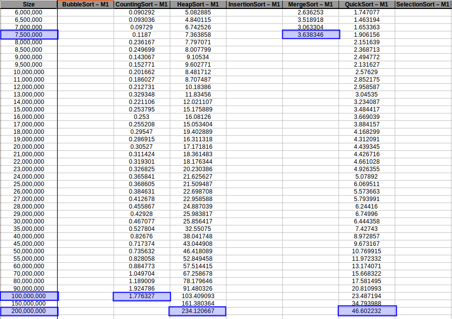

#### 3.4.2. Capacidad máxima de procesamiento para M2 con 2GB de RAM
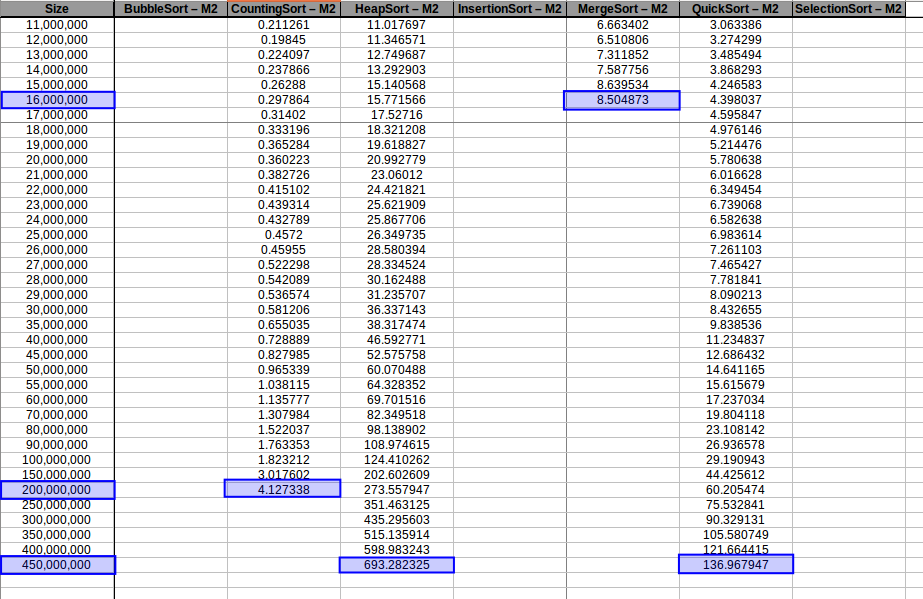

En los resultados obtenidos, se puede ver claramente como la capacidad de memoria extra le permitio a M2, procesar el doble o en algunos caso el triple o más de lo que pudo M1, todo esto depende de como cada algoritmo esta diseñado, por ejemplo vemos que el **mergeSort** fue el que menos aguanto, debido a que utiliza un arreglo auxiliar de tamaño igual a N, por lo tanto ocupa dos veces más memoria de la que ocuparía por ejemplo el **quickSort** que no requiere arreglo auxiliar. Aprovechando que tenemos nuevos datos, procedemos a gráficar nuevamente estos algoritmos con el fin de obtener unas curvas de comportamiento más uniformes.

#### 3.4.3. Conteo (Counting Sort) hasta el máximo volumen de datos: O(n+k)
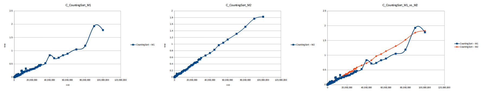

#### 3.4.4. Montones (Heapsort) hasta el máximo volumen de datos: O(n log n)
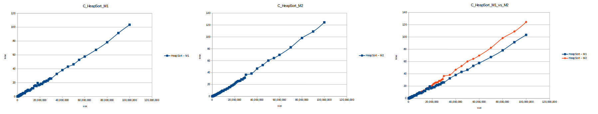

#### 3.4.5. Mezclas (Merge Sort) hasta el máximo volumen de datos: O(n log n)
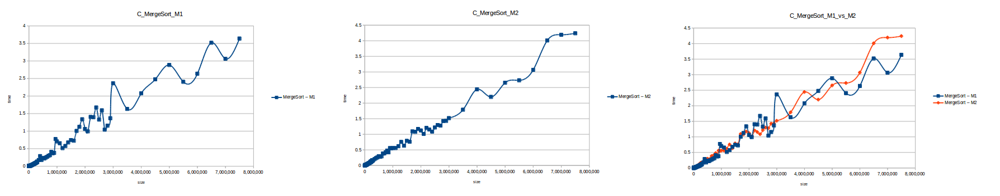

#### 3.4.6. Rápido (Quicksort) hasta el máximo volumen de datos: O(n log n)
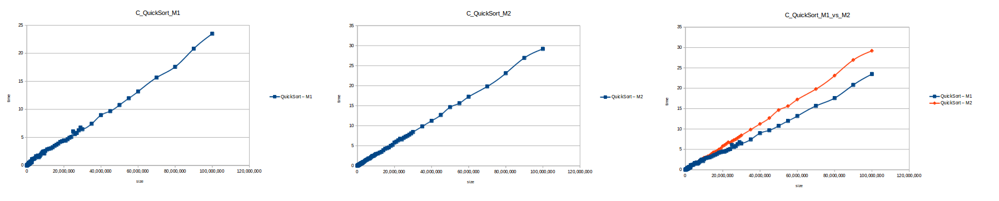

#### 3.4.7 Gráfica comparativa de los algoritmos eficientes hasta el máximo volumen de datos
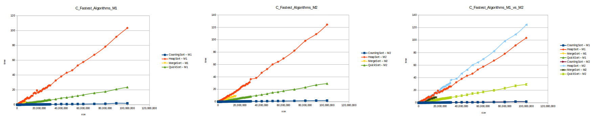
